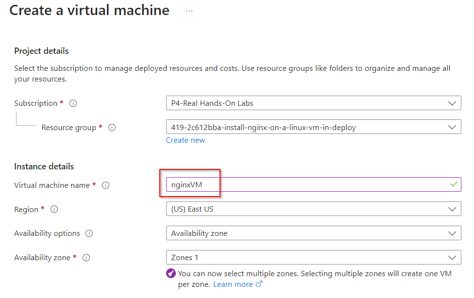
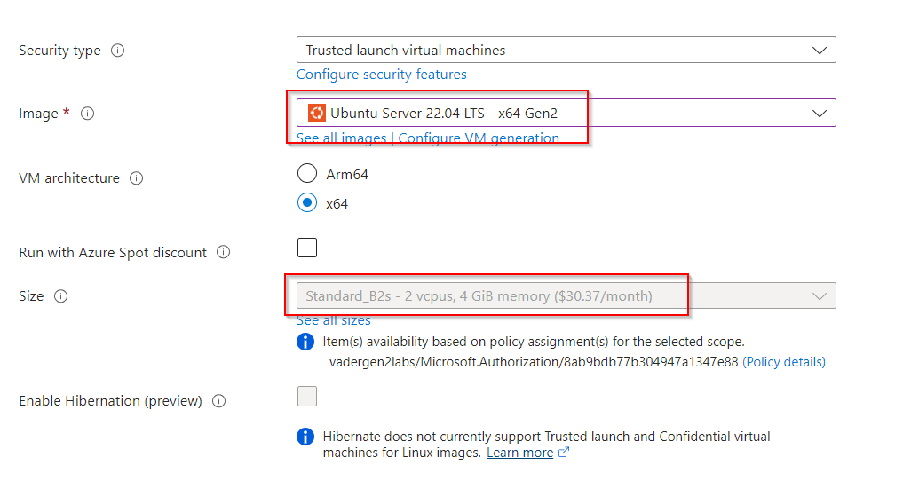
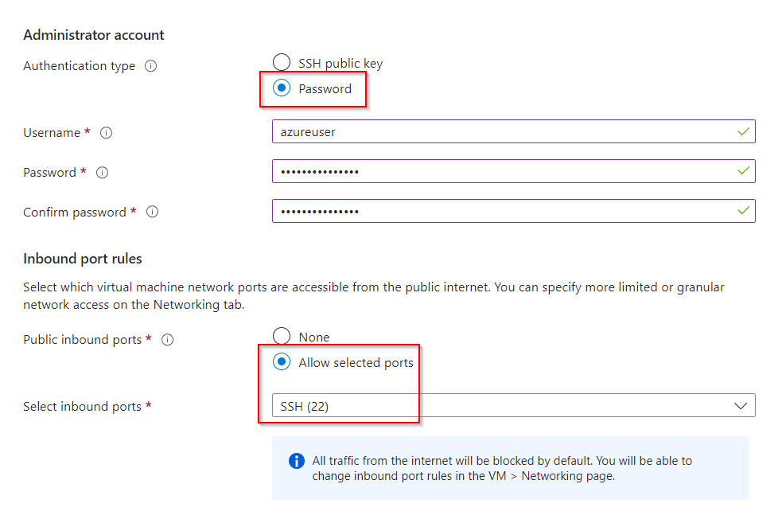
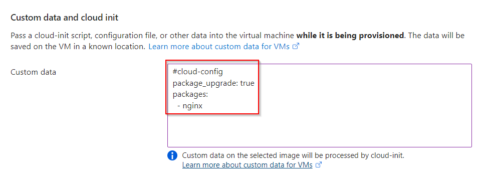
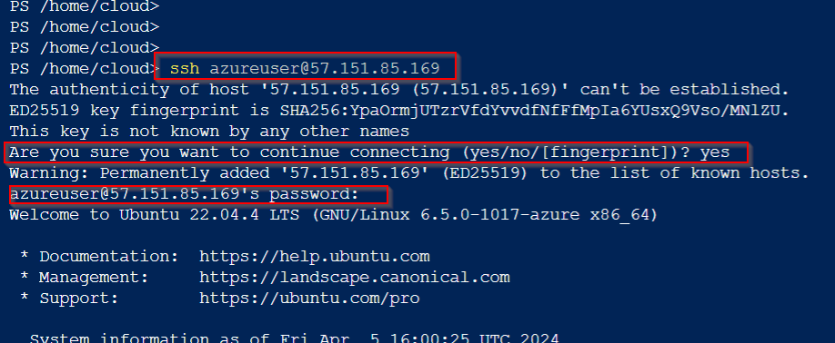
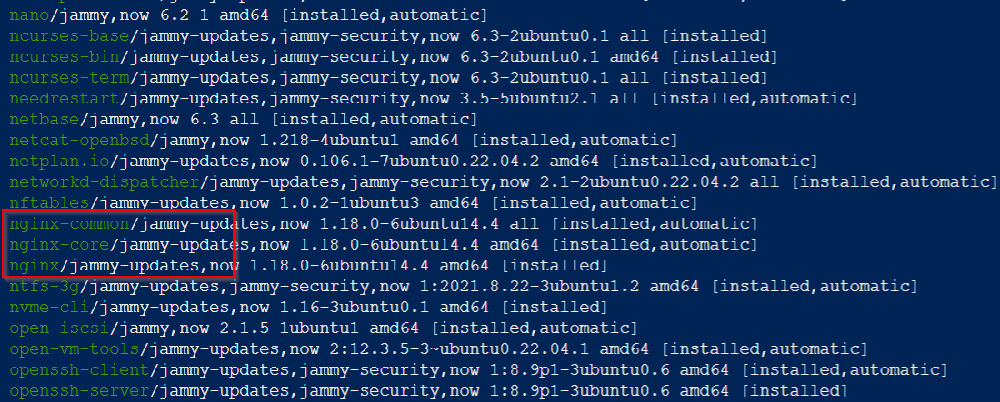

# Install NGINX on a Linux VM in Deployment with Cloud Init

**There are 2 objectives with this lab:**
* Deploy a Linux VM with NGINX Installed
* Test the VM

## Deploy a Linux VM with NGINX Installed

In the first part of the lab, we're going to create the VM and use cloud-init to install NGINX. So lets navigate to your resource group (RG) and create a VM with the following properties: 
- Image: Ubuntu Server 22.04 LTS - x64 Gen2
- Size: Standard_B2ms
- Authentication type: Password
- Select inbound ports: SSH (22)

I named my VM `nginxVM`.

Next, lets choose the VM image and size. Make sure you click see all sizes so that you can change the size of the VM. 

Then, we'll choose the authentication type and the allowed inbound ports. For the password authentication, you'll have to make a username and password. 

Now, on to the fun part. We need to fastforward to the Advanced tab for our virtual machine. If you scroll down on this page, you'll find a text box labeled Custom data and cloud init. This is where we'll put in the code to auto-install NGINX onto our VM. I found the code on the Microsoft webpage ([link here](https://learn.microsoft.com/en-us/azure/virtual-machines/linux/tutorial-automate-vm-deployment)). Copy and paste it into this box. 

Create your VM and after it's deployed, we'll SSH into the machine. 

That completes the first half of this lab!

## Test the VM

For the second portion of this lab, we're just going to verify that NGINX is installed on the VM. So first, lets create an Azure CLI session using PowerShell to SSH into the machine. 

Once you've got the Azure CLI session going, use `ssh <USER>@<PUBLIC IP>` command to log into the device. This user is the same username you created when you made the VM. This Public IP (PIP) should be the same PIP that was created for you when you created the VM. Go the VM and mark it down. You'll be prompted for a password which is the same password you created for the username. 

Once here, we'll use the `apt list --installed` to see if NGINX is installed (I literally just googled "how to see installed apps in Linux terminal" and google gave me the answer).  

There you have it! Lab completed!

## Personal Notes

Another straightforward lab except the cloud-init portion. I definitely had to google how to do that. It seemed way more simple than I imagined but I also would not have known about this. 

